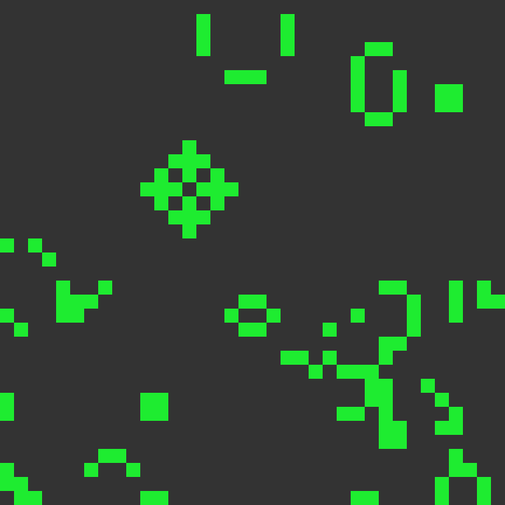
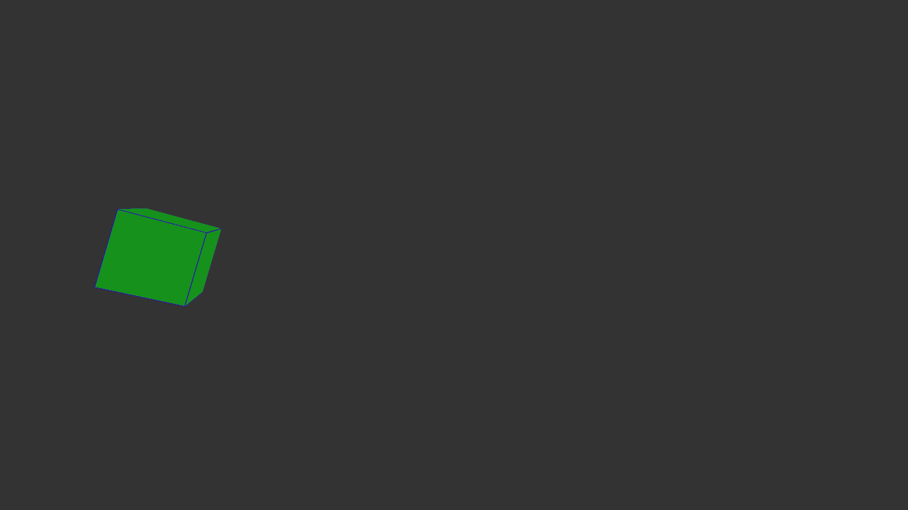
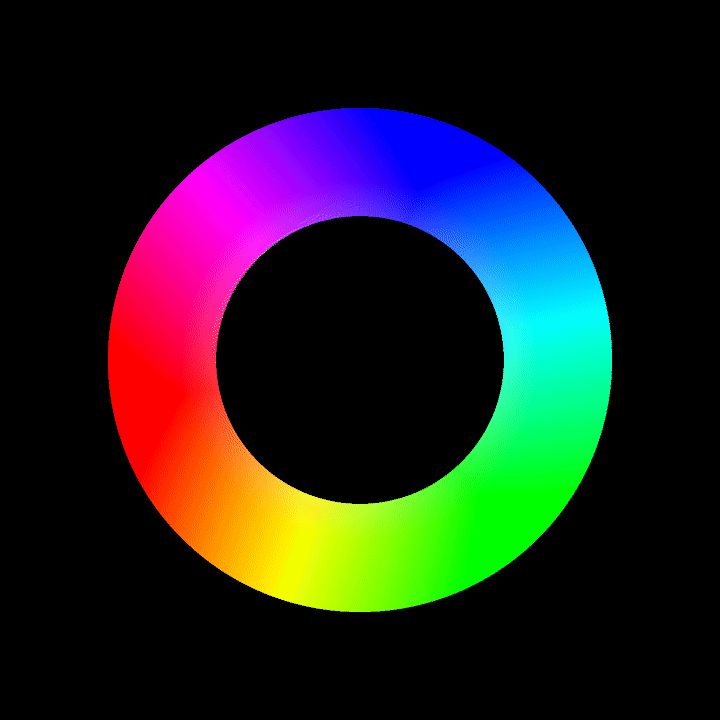

# Visualization
A Collection of fun visualizations.

To try them out, run `demo_launcher.py`.

Settings can be accessed by passing the usual arguments `"-s 4 --fullscreen"` to the settings promt. 
Validity of the settings is *not* checked.

## NBody

A O(n**2) implementation of the NBody simulation using Eulers integrator

## ComputeShader Example

Bouncing particles done with a compute-shader

## Conway's Game of Life

## TextArt

Assembling text from small circles

## CubeVis

A rotating cube that can be translated, scaled and rotated

## Fractal

Zooming into a julia set.

## Voronoi

Generate a moving voronoi diagram

## PolarPrimes

Display prime numbers in a polar coordinate system.

## HSV Color Wheel

Generate a hsv color wheel

## Gradient

Generate a radial gradient

