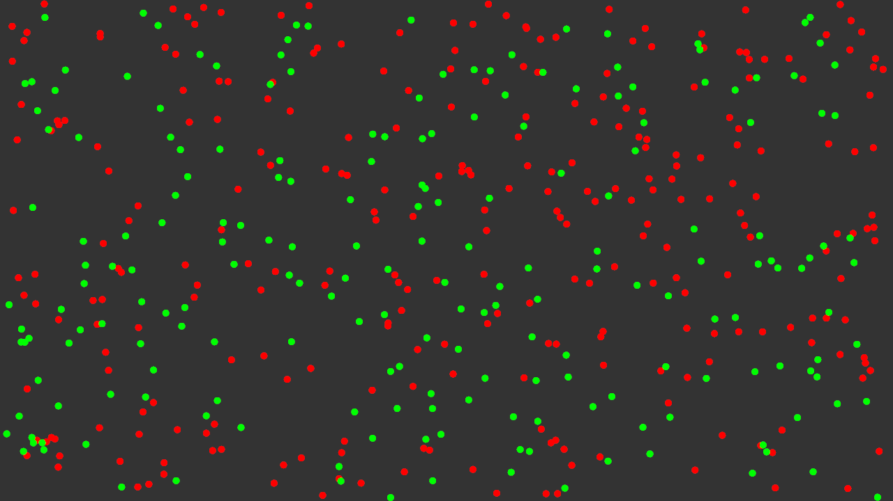

# Visualization
A Collection of fun visualizations.

## NBody

A O(n**2) implementation of the NBody simulation using Eulers integrator

## ComputeShader Example

Bouncing particles done with a compute-shader

## TextArt

Assembling text from small circles

## CubeVis

A rotating cube that can be translated, scaled and rotated

## Fractal

Zooming into a julia set.

## Voronoi

Generate a moving voronoi diagram

## PolarPrimes

Display prime numbers in a polar coordinate system.

## HSV Color Wheel

Generate a hsv color wheel

## Gradient

Generate a radial gradient

